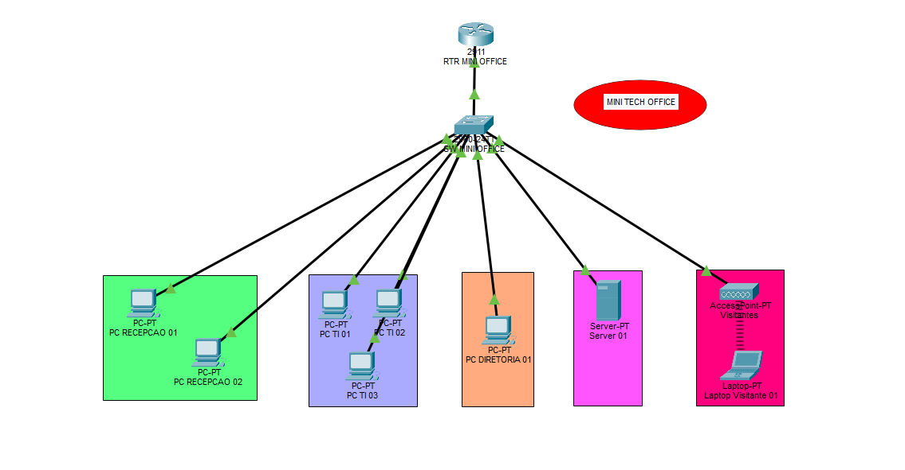
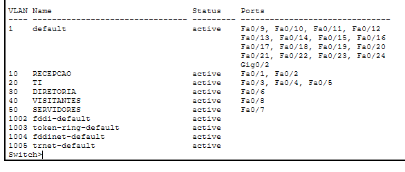
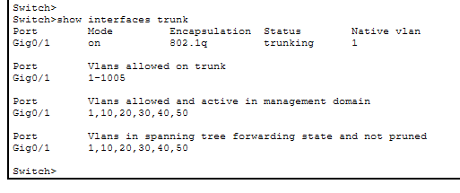
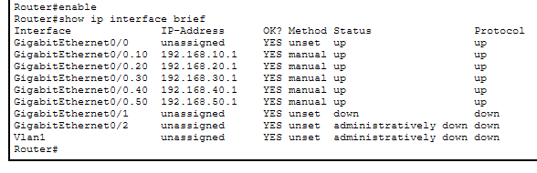
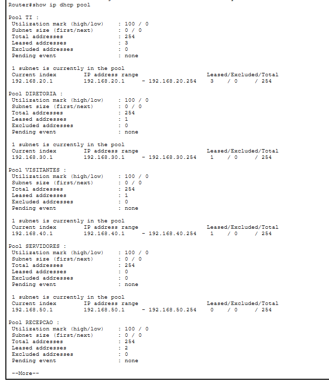
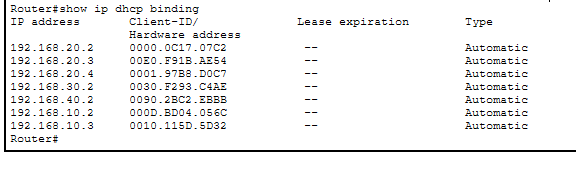
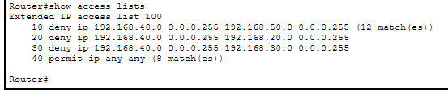
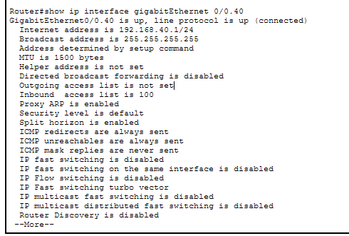
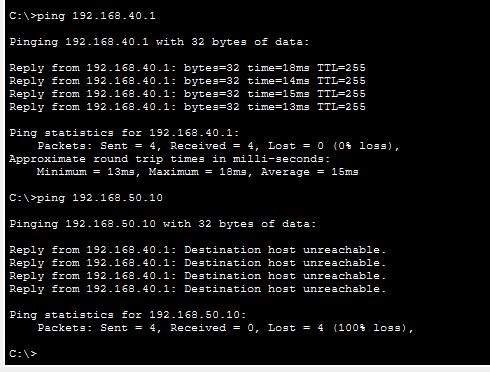
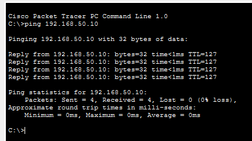

```markdown
# 🏢 Mini-Tech-Office

<div align="center">


</div>

---

## 📌 Sobre o projeto

Projeto de infraestrutura de rede corporativa simulada desenvolvido no **Cisco Packet Tracer**.

O objetivo deste projeto foi criar uma pequena rede empresarial utilizando conceitos fundamentais de redes de computadores, como:

- VLANs para segmentação da rede.
- Trunk para comunicação entre dispositivos de rede.
- Router-on-a-Stick para comunicação entre VLANs.
- DHCP para distribuição automática de endereços IP.
- Wi-Fi através de Access Point.
- ACL para controle de acesso entre departamentos.

A rede representa uma pequena empresa chamada **Mini-Tech-Office**, contendo diferentes setores com níveis de acesso diferentes.

---

<div align="center">

## 🎯 Objetivos do projeto

</div>

Implementar uma infraestrutura de rede organizada, segura e escalável contendo:

- Separação dos setores através de VLANs.
- Comunicação entre redes diferentes utilizando roteamento.
- Configuração automática dos computadores.
- Rede sem fio para visitantes.
- Controle de acesso utilizando regras de segurança.

---

<div align="center">

## 🖥️ Equipamentos utilizados

</div>

| Equipamento | Função |
|-------------|--------|
| Router Cisco | Roteamento entre VLANs e aplicação das ACLs |
| Switch Cisco | Comunicação interna e criação das VLANs |
| Access Point | Disponibilizar rede wireless para visitantes |
| PCs | Representar usuários dos departamentos |
| Servidor | Representar recursos internos da empresa |

---

<div align="center">

## 📡 Topologia da rede

</div>

A topologia criada contém:

- 1 Router Cisco
- 1 Switch Cisco
- 1 Access Point
- Computadores dos setores:
  - Recepção
  - TI
  - Diretoria
  - Visitantes
  - Servidores



---

<div align="center">

## 🌐 Planejamento de VLANs

</div>

As VLANs foram utilizadas para separar logicamente os departamentos.

Cada setor possui sua própria rede, aumentando a organização e segurança.

| VLAN | Nome | Departamento | Rede |
|------|------|--------------|------|
| 10 | RECEPCAO | Recepção | 192.168.10.0/24 |
| 20 | TI | Tecnologia da Informação | 192.168.20.0/24 |
| 30 | DIRETORIA | Diretoria | 192.168.30.0/24 |
| 40 | VISITANTES | Wi-Fi Visitantes | 192.168.40.0/24 |
| 50 | SERVIDORES | Servidores | 192.168.50.0/24 |

---

## Planejamento de endereçamento IP

Cada VLAN recebeu uma rede IPv4 própria utilizando máscara /24.

A máscara:

```
255.255.255.0
```

permite até 254 endereços disponíveis para dispositivos dentro de cada rede.

Exemplo:

- Rede: 192.168.20.0/24
- Gateway: 192.168.20.1
- Faixa disponível: 192.168.20.2 - 192.168.20.254
- Broadcast: 192.168.20.255

---

## Endereçamento dos dispositivos

> Observação: A topologia utiliza apenas um Router Cisco físico. Os gateways das VLANs são configurados como subinterfaces no mesmo roteador utilizando a técnica Router-on-a-Stick.

| Dispositivo | Interface/Subinterface | IP | Função |
|-------------|------------------------|-----|--------|
| Router Cisco (único) | G0/0.10 - VLAN 10 | 192.168.10.1 | Gateway da Recepção |
| Router Cisco (único) | G0/0.20 - VLAN 20 | 192.168.20.1 | Gateway da TI |
| Router Cisco (único) | G0/0.30 - VLAN 30 | 192.168.30.1 | Gateway da Diretoria |
| Router Cisco (único) | G0/0.40 - VLAN 40 | 192.168.40.1 | Gateway dos Visitantes |
| Router Cisco (único) | G0/0.50 - VLAN 50 | 192.168.50.1 | Gateway dos Servidores |
| Servidor | - | 192.168.50.10 | Servidor da rede |

---

### Funcionamento das VLANs

Cada VLAN representa uma rede independente dentro do switch.

Por exemplo:

- A VLAN 10 (Recepção) utiliza a rede 192.168.10.0/24.
- A VLAN 20 (TI) utiliza a rede 192.168.20.0/24.
- A VLAN 50 (Servidores) utiliza a rede 192.168.50.0/24.

Mesmo estando conectados ao mesmo switch físico, os dispositivos de VLANs diferentes não se comunicam diretamente.

Para que exista comunicação entre VLANs, é necessário utilizar um dispositivo de camada 3, neste caso o Router Cisco.

As VLANs também ajudam a reduzir o domínio de broadcast, melhorar a organização e aumentar a segurança da rede.

Cada VLAN cria um domínio de broadcast separado.

Isso significa que um broadcast enviado dentro da VLAN 10 não será recebido pelos dispositivos da VLAN 20.

Essa separação melhora desempenho e segurança da rede.

---

<div align="center">

## 🔀 Configuração das VLANs

</div>

As VLANs foram criadas no Switch para separar os dispositivos.

Comando utilizado:

```bash
enable
configure terminal

vlan 10
name RECEPCAO

vlan 20
name TI

vlan 30
name DIRETORIA

vlan 40
name VISITANTES

vlan 50
name SERVIDORES
```

---

## Associação das portas às VLANs

As portas conectadas aos computadores foram configuradas no modo access.

Uma porta access pertence a apenas uma VLAN e é utilizada normalmente para conectar dispositivos finais, como:

- Computadores.
- Servidores.
- Impressoras.
- Access Points.

Exemplo:

```bash
interface fastEthernet 0/3

switchport mode access

switchport access vlan 20
```

Nesse caso, a porta Fa0/3 pertence à VLAN 20 (TI).

---

### Verificação:

```bash
show vlan brief
```

Esse comando mostra:

- VLANs existentes.
- Nome das VLANs.
- Portas associadas.

Resultado:



---

<div align="center">

## 🔗 Configuração do Trunk

</div>

O trunk permite transportar múltiplas VLANs através de uma única conexão física.

Neste projeto, o link entre Switch e Router foi configurado como trunk.

Comando:

```bash
interface gigabitEthernet 0/1

switchport mode trunk
```

O trunk foi configurado na interface do Switch conectada ao Router.

O switch adiciona a tag 802.1Q aos quadros Ethernet quando eles precisam atravessar um link trunk.

O Router não cria VLANs, ele apenas interpreta as tags 802.1Q recebidas pela interface trunk e encaminha o tráfego entre as redes.

O Router utiliza essa informação para encaminhar cada quadro para a subinterface correspondente.

Verificação:

```bash
show interfaces trunk
```

O resultado mostra:

- Interface em modo trunk.
- Protocolo 802.1Q.
- VLANs permitidas.

O trunk é necessário porque existe apenas um cabo conectado entre o Switch e o Router.

Esse único link precisa transportar informações de várias VLANs ao mesmo tempo.

O protocolo IEEE 802.1Q adiciona uma identificação chamada VLAN Tag nos quadros Ethernet, permitindo que o equipamento saiba a qual VLAN cada pacote pertence.



---

<div align="center">

## 🌐 Router-on-a-Stick

</div>

Como o Router precisa se comunicar com várias VLANs, foram criadas subinterfaces.

Cada subinterface funciona como gateway de uma VLAN.

O gateway é o endereço IP do Router utilizado pelos computadores para acessar outras redes.

Exemplo:

Um computador da VLAN TI:

- IP: 192.168.20.3
- Gateway: 192.168.20.1

Quando esse computador precisa acessar um servidor da VLAN 50, ele envia o pacote para o gateway 192.168.20.1.

O Router então realiza o roteamento entre as redes.

---

## Comunicação entre VLANs

As VLANs são redes separadas e não conseguem se comunicar diretamente através do Switch.

O Router é responsável por realizar o roteamento entre essas redes.

Exemplo:

Um computador da VLAN 10:

```
192.168.10.3
```

acessando um servidor:

```
192.168.50.10
```

O tráfego passa pelo gateway:

```
192.168.10.1
```

O Router analisa a rota e encaminha o pacote para a rede:

```
192.168.50.0/24
```

até chegar ao servidor:

```
192.168.50.10
```

---

Configuração:

```bash
interface gigabitEthernet 0/0.10

encapsulation dot1Q 10

ip address 192.168.10.1 255.255.255.0
```

O comando:

```bash
encapsulation dot1Q 10
```

define que aquela subinterface pertence à VLAN 10 utilizando o padrão IEEE 802.1Q.

Cada subinterface precisa estar associada à sua VLAN correspondente.

Exemplo completo:

| Interface | VLAN | Gateway |
|-----------|------|---------|
| G0/0.10 | 10 | 192.168.10.1 |
| G0/0.20 | 20 | 192.168.20.1 |
| G0/0.30 | 30 | 192.168.30.1 |
| G0/0.40 | 40 | 192.168.40.1 |
| G0/0.50 | 50 | 192.168.50.1 |

Verificação:

```bash
show ip interface brief
```

Esse comando mostra o estado das interfaces e os endereços IP configurados.



---

<div align="center">

## 📡 Configuração DHCP

</div>

O DHCP foi utilizado para entregar automaticamente:

- Endereço IP.
- Máscara.
- Gateway.
- Configurações de rede.

Exemplo:

```bash
ip dhcp pool TI

network 192.168.20.0 255.255.255.0

default-router 192.168.20.1
```

Cada pool representa uma faixa de endereços IP disponível para uma determinada VLAN.

Exemplo:

Pool TI:

- Rede: 192.168.20.0/24
- Gateway: 192.168.20.1

Os computadores conectados na VLAN TI recebem automaticamente endereços dentro dessa rede.

Foram criados pools DHCP para:

- Recepção.
- TI.
- Diretoria.
- Visitantes.

Servidores normalmente utilizam IP fixo, pois outros dispositivos precisam encontrar esses serviços sempre no mesmo endereço.

Exemplo:

- Servidor Web: 192.168.50.10

Caso ele recebesse IP automático pelo DHCP, esse endereço poderia mudar e causar problemas de acesso.

Verificação:

```bash
show ip dhcp pool
```



---

### Clientes recebendo IP

Comando:

```bash
show ip dhcp binding
```

Esse comando mostra a associação entre o endereço IP entregue e o dispositivo que recebeu aquele endereço.

Isso permite verificar quais equipamentos estão utilizando endereços distribuídos pelo DHCP.



---

## Funcionamento do DHCP (DORA)

Quando um dispositivo entra na rede e precisa de um endereço IP, ocorre o processo DORA:

### Discover

O cliente envia uma mensagem broadcast procurando servidores DHCP disponíveis.

### Offer

O servidor DHCP responde oferecendo um endereço IP disponível.

### Request

O cliente solicita oficialmente aquele endereço.

### Acknowledge

O servidor confirma a entrega do endereço IP.

Após isso, o dispositivo recebe:

- IP
- Máscara
- Gateway
- DNS

---

<div align="center">

## 📶 Rede Wireless

</div>

Foi configurado um Access Point para disponibilizar uma rede sem fio destinada aos visitantes da empresa.

A rede wireless foi criada utilizando a **VLAN 40 (Visitantes)**, mantendo os dispositivos conectados pelo Wi-Fi separados da rede interna da empresa.

Essa separação permite oferecer acesso à internet/rede para visitantes sem permitir acesso direto aos setores internos, como TI e Servidores.

A rede de visitantes foi separada da rede corporativa utilizando VLAN, evitando que dispositivos desconhecidos tenham acesso aos recursos internos.

Configurações realizadas:

| Item | Valor |
|------|-------|
| Dispositivo | Visitantes |
| SSID | Mini-Tech-Guest |
| Rede associada | VLAN 40 |
| Frequência | 2.4 GHz |
| Canal | 1 |
| Segurança | WPA2-PSK |
| Criptografia | AES |
| Senha | Minitech123 |
| Gateway | 192.168.40.1 |
| DHCP | Ativo |

O SSID é o nome público da rede wireless que aparece para os dispositivos próximos.

Ele funciona como o identificador da rede Wi-Fi.

---

## Configuração de segurança Wireless

A rede sem fio foi protegida utilizando o padrão **WPA2-PSK (Wi-Fi Protected Access 2 - Pre-Shared Key)**.

Esse método utiliza uma chave compartilhada entre o Access Point e os dispositivos autorizados, impedindo que usuários sem a senha consigam se conectar à rede.

Configuração aplicada:

```
Authentication:
WPA2-PSK

Encryption Type:
AES

PSK Pass Phrase:
Minitech123
```

O protocolo **AES (Advanced Encryption Standard)** foi utilizado para realizar a criptografia dos dados transmitidos pela rede wireless, aumentando a segurança da comunicação.

---

## Funcionamento da rede Wi-Fi

O funcionamento da rede ocorre da seguinte forma:

1. O dispositivo visitante encontra a rede através do SSID:

```
Mini-Tech-Guest
```

2. O usuário informa a senha configurada no WPA2-PSK.

3. O Access Point autentica o dispositivo e permite a conexão.

4. O dispositivo recebe automaticamente um endereço IP através do DHCP da VLAN 40.

Exemplo:

```
Rede:
192.168.40.0/24

Gateway:
192.168.40.1
```

Após receber um endereço IP, o dispositivo passa a se comunicar com o Router.

A comunicação da VLAN 40 é controlada através das regras de ACL configuradas no Router, permitindo o acesso necessário e bloqueando tentativas de acesso aos recursos internos da empresa.

---

<div align="center">

## 🔐 Configuração de ACL

A ACL (**Access Control List**) foi utilizada para implementar controle de acesso entre as redes da empresa.

Neste projeto, a ACL foi aplicada na rede de visitantes (VLAN 40) com o objetivo de impedir que dispositivos externos tenham acesso aos recursos internos da empresa.

Objetivo:

- Visitantes podem se comunicar dentro da própria rede.
- Visitantes não podem acessar servidores.
- Visitantes não podem acessar a rede da TI.
- Visitantes não podem acessar a rede da Diretoria.

A ACL funciona analisando os pacotes que passam pelo Router e comparando as informações de origem e destino com as regras configuradas.

Exemplo:

- Origem: `192.168.40.0/24` → Rede de Visitantes
- Destino: `192.168.50.0/24` → Rede de Servidores
- Resultado: Tráfego bloqueado.

---

### Estrutura do comando ACL

A estrutura básica de uma ACL Cisco é:

```bash
access-list número ação protocolo origem wildcard destino wildcard
```

Exemplo:

```bash
access-list 100 deny ip 192.168.40.0 0.0.0.255 192.168.50.0 0.0.0.255
```

Explicação:

- `access-list 100` → cria uma ACL identificada pelo número 100.
- `deny` → bloqueia o tráfego que corresponde à regra.
- `ip` → analisa tráfego baseado no protocolo IP.
- `192.168.40.0 0.0.0.255` → define a rede de origem (Visitantes).
- `192.168.50.0 0.0.0.255` → define a rede de destino (Servidores).

Essa regra significa:

> Bloquear qualquer dispositivo da rede de visitantes tentando acessar qualquer dispositivo da rede de servidores.

---

### Regras configuradas

```bash
access-list 100 deny ip 192.168.40.0 0.0.0.255 192.168.50.0 0.0.0.255
```

Bloqueia:

```
Visitantes → Servidores
```

---

```bash
access-list 100 deny ip 192.168.40.0 0.0.0.255 192.168.20.0 0.0.0.255
```

Bloqueia:

```
Visitantes → TI
```

---

```bash
access-list 100 deny ip 192.168.40.0 0.0.0.255 192.168.30.0 0.0.0.255
```

Bloqueia:

```
Visitantes → Diretoria
```

---

```bash
access-list 100 permit ip any any
```

Permite qualquer outro tráfego que não corresponda às regras anteriores.

Essa regra é importante porque as ACLs Cisco possuem uma regra implícita no final que bloqueia todo tráfego não permitido.

---

## Wildcard Mask

Nas ACLs Cisco é utilizada uma **Wildcard Mask** para identificar quais endereços IP devem ser considerados na comparação.

Ela funciona de forma diferente da máscara de sub-rede:

- Valor `0` → o valor precisa ser exatamente igual.
- Valor `255` → o valor pode variar.

Exemplo:

```
Rede:
192.168.40.0

Wildcard:
0.0.0.255
```

Representa todos os dispositivos da rede:

```
192.168.40.X
```

Exemplos correspondentes:

```
192.168.40.10
192.168.40.50
192.168.40.200
```

Ou seja, a regra será aplicada para qualquer dispositivo pertencente à VLAN 40.

---

## Aplicação da ACL

Após criar as regras, a ACL foi aplicada na entrada da subinterface da VLAN 40:

```bash
interface gigabitEthernet 0/0.40

ip access-group 100 in
```

Explicação:

- `interface gigabitEthernet 0/0.40` → acessa a subinterface responsável pela VLAN 40.
- `ip access-group 100 in` → aplica a ACL 100 para o tráfego que entra nessa interface.

Isso significa que todo pacote enviado pelos visitantes passa pela ACL antes de ser encaminhado pelo Router.

---

## Verificação da ACL

Para verificar as regras configuradas:

```bash
show access-lists
```

Esse comando exibe:

- Regras existentes.
- Permissões e bloqueios configurados.
- Quantidade de pacotes que passaram por cada regra.



Para verificar a aplicação da ACL na interface:

```bash
show ip interface gigabitEthernet 0/0.40
```

Esse comando mostra se a ACL está aplicada corretamente na subinterface da VLAN 40.



</div>

---

<div align="center">

## 🧪 Testes realizados

</div>

### Visitantes → Gateway

Teste:

```bash
ping 192.168.40.1
```

Resultado:

✅ Comunicação funcionando.

---

### Visitantes → Servidor

Teste:

```bash
ping 192.168.50.10
```

Resultado:

❌ Bloqueado pela ACL.

Esse teste comprova que a regra de segurança está funcionando, pois o visitante consegue acessar seu gateway, mas não consegue alcançar recursos protegidos da rede interna.

O comando ping foi utilizado para validar a comunicação entre dispositivos.

Respostas recebidas indicam que existe conectividade entre origem e destino.

Quando a ACL bloqueia o tráfego, o pacote não é encaminhado ao destino, impedindo a comunicação entre as redes.



---

### Rede interna → Servidor

Teste:

```bash
ping 192.168.50.10
```

Resultado:

✅ Comunicação permitida.



---

<div align="center">

## 📚 Conceitos aplicados

</div>

### VLAN

Permite criar redes lógicas separadas dentro do mesmo switch físico.

Benefícios:

- Organização.
- Segurança.
- Redução de broadcast.

---

### Trunk

Permite transportar várias VLANs através de um único cabo utilizando o protocolo 802.1Q.

---

### Router-on-a-Stick

Técnica utilizada para permitir comunicação entre VLANs usando subinterfaces em um único link físico.

---

### DHCP

Protocolo responsável pela configuração automática dos dispositivos da rede.

---

### ACL

Recurso de segurança utilizado para permitir ou bloquear determinados tipos de tráfego.

---

## Relação com o modelo OSI

Durante o projeto foram utilizados conceitos presentes em diferentes camadas do modelo OSI:

| Camada | Aplicação |
|--------|-----------|
| Camada 2 - Enlace | VLAN, Switch, Trunk, 802.1Q |
| Camada 3 - Rede | Router, IP, Gateway, ACL |
| Camada 4 - Transporte | Comunicação utilizando protocolos TCP/UDP |
| Camada 7 - Aplicação | DHCP (atribuição automática de IP, máscara, gateway e DNS). |

---

## Configuração do servidor

O servidor foi configurado manualmente dentro da VLAN 50.

Configuração:

- IP: 192.168.50.10
- Máscara: 255.255.255.0
- Gateway: 192.168.50.1
- DNS: 8.8.8.8

O servidor foi utilizado como recurso interno para validar a comunicação entre redes e testar as regras de ACL.

---

<div align="center">

## 🛠️ Principais comandos utilizados

</div>

| Comando | Função |
|---------|--------|
| `show vlan brief` | Exibe VLANs criadas e portas associadas |
| `show interfaces trunk` | Verifica links trunk e VLANs passando pelo link |
| `show ip interface brief` | Mostra interfaces, IPs e status |
| `show ip dhcp pool` | Exibe pools DHCP configurados |
| `show ip dhcp binding` | Mostra dispositivos que receberam IP pelo DHCP |
| `show access-lists` | Exibe regras ACL e quantidade de correspondências |
| `copy running-config startup-config` | Salva a configuração permanentemente |

---

## Salvando configurações

Após finalizar as configurações, foi utilizado:

```bash
copy running-config startup-config
```

Esse comando copia a configuração atual da memória RAM (running-config) para a memória permanente (startup-config).

Assim, as configurações permanecem após reiniciar o equipamento.

---

<div align="center">

## 🧠 O que aprendi

</div>

Durante o desenvolvimento deste projeto pratiquei:

- Configuração de switches Cisco.
- Criação e gerenciamento de VLANs.
- Comunicação entre redes utilizando Router-on-a-Stick.
- Implementação de DHCP.
- Aplicação de ACLs para segurança.
- Diagnóstico de problemas utilizando comandos show.

---

<div align="center">

## ✅ Conclusão

</div>

O projeto Mini-Tech-Office simulou uma pequena infraestrutura empresarial utilizando conceitos fundamentais de redes Cisco.

Durante o desenvolvimento foram aplicados conhecimentos de:

- Switching.
- VLAN.
- Routing.
- DHCP.
- Wireless.
- Segurança de rede.
- Controle de acesso.

Este projeto serviu como prática de administração de redes Cisco, permitindo aplicar conceitos utilizados em ambientes corporativos, como segmentação de rede, controle de acesso, gerenciamento de endereçamento IP e segurança de infraestrutura.

---

<div align="center">

### 🟢 Status: Concluído

---

## 👨‍💻 Autor

**Pablo Gonçalves Santos**

Estudante de Sistemas da Informação com foco em Redes e Cibersegurança.

---

[](https://github.com/pablogsantoscontato-ops)

---

<sub>Desenvolvido com ❤️ para o aprendizado de redes</sub>

</div>
```
